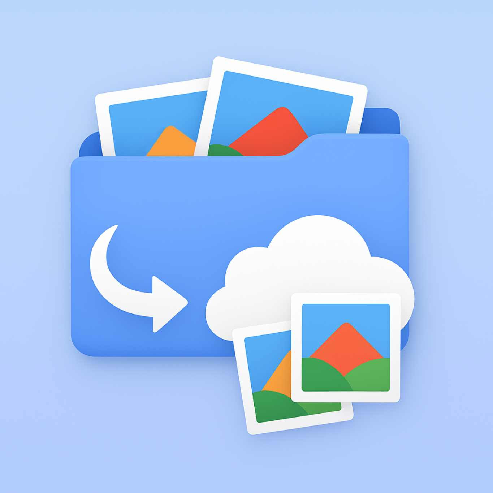

#  Photo Uploader

&nbsp;&nbsp;

&nbsp;&nbsp;&nbsp;&nbsp;

**Organized Folder-to-Album uploads for Google Photos.**

Photo Uploader is a utility application designed to bridge the gap between your locally organized photo collection and Google Photos. It automates the creation of albums based on your folder structure, ensuring your organization is preserved exactly as you intended.

> **"Rooted in clarity. Fluent in use."** — *True Pine Apps*

---

## 🌟 Key Features

*   **📂 Folder-to-Album Mapping:** Automatically derives album names from your local folder names.
*   **🧩 Smart Flattening:** Handles complex nested folder structures by presenting a clear, flattened list of potential albums.
*   **✏️ Flexible Renaming:** Change album names within the app before uploading without affecting your local files.
*   **✅ Granular Control:** Enable or disable specific albums or individual photos to customize exactly what gets uploaded.
*   **🛡️ Privacy First:** All photo processing is local. Your photos and credentials never touch a third-party server.
*   **📊 Upload Summary:** View a clear summary of created albums and the final status of your photos (success, skipped, or failed).

---

## 🚀 User Flow

1.  **Select Source:** Start by selecting the root folder of your photo collection.
2.  **Preview & Organize:** Review the detected albums. Rename albums, toggle selections, or manage individual photos.
3.  **Start Upload:** Click the Upload button. If not already signed in, you will be prompted to authenticate securely with Google in your default browser.
4.  **Review Summary:** Once authenticated, a summary screen shows the final counts before the transfer begins.
5.  **Monitor Progress:** Track real-time status. Uploaded items are automatically disabled to prevent accidental double-uploads.
6.  **Verify:** After the report is shown, we recommend verifying the results in Google Photos before deleting any local copies.

---

## 📲 Installation & Download

Releases are currently available for **Desktop (Windows, macOS, and Linux)**. Mobile versions for Android and iOS are currently in development.

*   **Official Website:** [truepineapps.com/photouploader](https://truepineapps.com/photouploader)
*   **GitHub Releases:** [Download the latest artifacts here](https://github.com/truepineapps/photouploader/releases)

### Desktop Requirements

For full details, see the [Installation Guide](INSTALL.md).

*   **Windows:** Windows 10 or later (.msi)
*   **macOS:** macOS 12 (Monterey) or later (.dmg)
*   **Linux:** Modern 64-bit distributions (.deb)
*   **Java:** Runtime is bundled with the installer; no separate installation is required.

---

## 🛠️ Technical Stack

Built with the latest modern Android and Multiplatform technologies:

*   **Language:** Kotlin
*   **UI:** Compose Multiplatform with Material 3
*   **Networking:** Ktor
*   **Dependency Injection:** Koin
*   **Image Loading:** Coil
*   **Architecture:** Clean Architecture with Feature-based modularity

---

## 🔐 Privacy & Security

As a tool developed by **True Pine Apps** in the Netherlands, Photo Uploader is built with **GDPR compliance** at its core.

*   **Local Processing:** Your photos are read and transmitted directly from your device to Google.
*   **Limited Access:** The app only requests the minimum necessary Google Photos API scopes.
*   **No Data Harvesting:** We do not collect, store, or sell your photo content or personal metadata.

For more details, see our [Privacy Policy](PRIVACY.md) and [Terms of Service](TERMS.md).

Disclaimer: This application is not officially affiliated with or endorsed by Google LLC. Google Photos is a trademark of Google LLC.

---

## 🤝 Contributing & Development

We welcome feedback and contributions!

*   **Bug Reports:** Please open a [GitHub Issue](https://github.com/truepineapps/photouploader/issues).
*   **Development:** If you want to build from source, see [DEVELOPMENT.md](DEVELOPMENT.md).
*   **Guidelines:** See [CONTRIBUTING.md](CONTRIBUTING.md) for details on our workflow and [Architecture.md](Architecture.md) for technical design principles.

---

## ⚖️ License & Redistribution

This project is licensed under the **Apache License, Version 2.0**.
Third-party software attributions are listed in [NOTICES](composeApp/src/commonMain/composeResources/files/NOTICES).

If you redistribute this software or any modified version of it, you must comply with the terms of the license. Specifically, you must include:
- A copy of the [LICENSE](LICENSE) file.
- The [NOTICES](composeApp/src/commonMain/composeResources/files/NOTICES) file, which contains attributions for the third-party libraries used in this project.

---

##  About True Pine Apps

True Pine Apps is dedicated to creating high-quality multiplatform applications that prioritize user experience and technical excellence.

**Marcel van Heerwaarden**  
*Rooted in clarity. Fluent in use.*  
[truepineapps.com](https://truepineapps.com)
